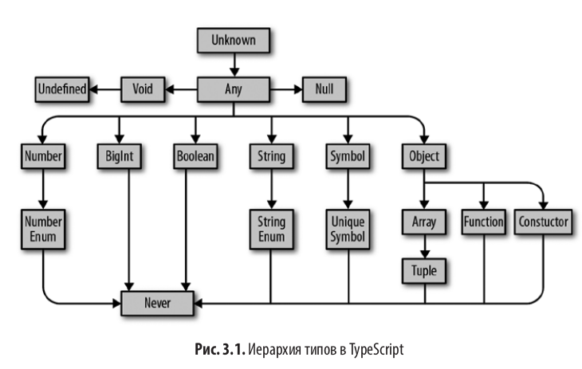

# typeScript_Learning

Examples and tasks from TS's textbook

# Answers for tasks:

https://github.com/bcherny/programming-typescript-answers

# TSLint for React:

https://www.npmjs.com/package/tslint-react

# Скомпилируйте код с помощью TSC

./node_modules/.bin/tsc

# Запустите код с помощью NodeJS

node ./dist/index.js

# Компиляция и запуск с помощью NPM (https://www.npmjs.com/package/ts-node)

Installation

# Locally in your project.

npm install -D typescript
npm install -D ts-node

# Or globally with TypeScript.

npm install -g typescript
npm install -g ts-node

# Depending on configuration, you may also need these

npm install -D tslib @types/node

# Execute a script as `node` + `tsc`.

ts-node script.ts

# инструмент автоматической генерации typescript-node-starter ( https://github.com/Microsoft/TypeScript-Node-Starter ) для быстрого создания структуры каталога.

# Иерархия типов в typeScript

