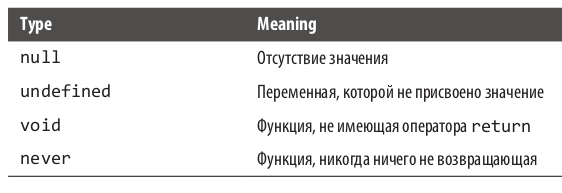

# typeScript_Learning

Examples and tasks from TS's textbook

# Answers for tasks:

https://github.com/bcherny/programming-typescript-answers

# TSLint for React:

https://www.npmjs.com/package/tslint-react

# Скомпилируйте код с помощью TSC

./node_modules/.bin/tsc

# Запустите код с помощью NodeJS

node ./dist/index.js

# Компиляция и запуск с помощью NPM

(https://www.npmjs.com/package/ts-node)

Installation

# Locally in your project.

npm install -D typescript
npm install -D ts-node

# Or globally with TypeScript.

npm install -g typescript
npm install -g ts-node

# Depending on configuration, you may also need these

npm install -D tslib @types/node

# Execute a script as `node` + `tsc`.

ts-node script.ts

# инструмент автоматической генерации typescript-node-starter ( https://github.com/Microsoft/TypeScript-Node-Starter ) для быстрого создания структуры каталога.

# Иерархия типов в typeScript

# СИГНАТУРЫ ИНДЕКСОВ

Синтаксис [key: T]: U называется сигнатурой индекса. С ее помощью вы со-
общаете компилятору, что данный объект может содержать больше ключей.
Читать его следует так: «Для этого объекта все ключи типа T должны иметь
значения типа U ». Сигнатуры индекса позволяют безопасно добавлять допол-
нительные ключи объекту, помимо объявленных ранее.
Но тип ( T ) ключа сигнатуры индекса должен быть совместим либо со string ,
либо с number 1 .
В качестве имени ключа сигнатуры индекса можно использовать любое сло-
во — не только key :

let airplaneSeatingAssignments: {
[seatNumber: string]: string
} = {
'34D': 'Boris Cherny',
'34E': 'Bill Gates'
}

# Типы, означающие отсутствие чего-либо

